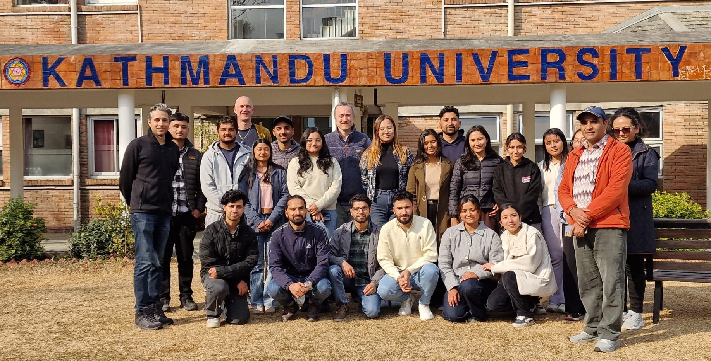

**Materials and Data for the Workshop "Combining Satellite and In-Situ Data for Ecosystem Monitoring"**

**YouTube Recordings are here: [https://youtube.com/playlist?list=PLf4x2rqfvPEMFtK6lAI8ek4c-ic8YqtKv&si=AD9ywVVV0LpRROyt](https://youtube.com/playlist?list=PLf4x2rqfvPEMFtK6lAI8ek4c-ic8YqtKv&si=AD9ywVVV0LpRROyt)**

Kathmandu, Feb 2026

*Workshop organized and led by Dr Taylor Smith (University of Potsdam, Germany), Dr Bodo Bookhagen (University of Potsdam, Germany) and Dr Shakil Regmi (South-Eastern Finland University of Applied Sciences, Finland)*
